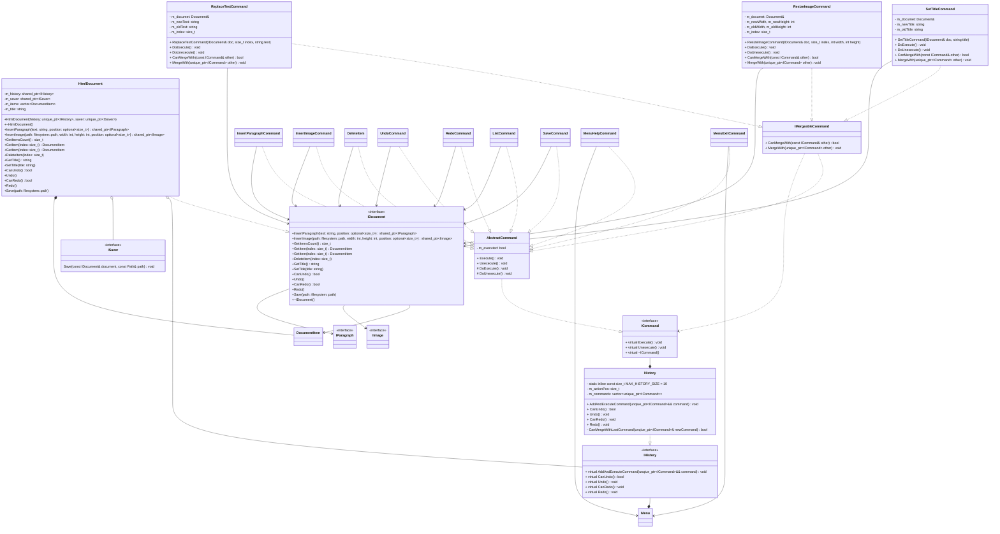

```mermaid
classDiagram
    class IDocument {
        <<interface>>
        +InsertParagraph(text: string, position: optional~size_t~) shared_ptr~IParagraph~
        +InsertImage(path: filesystem::path, width: int, height: int, position: optional~size_t~) shared_ptr~IImage~
        +GetItemsCount() size_t
        +GetItem(index: size_t) DocumentItem
        +GetItem(index: size_t) DocumentItem
        +DeleteItem(index: size_t)
        +GetTitle() string
        +SetTitle(title: string)
        +CanUndo() bool
        +Undo()
        +CanRedo() bool
        +Redo()
        +Save(path: filesystem::path)
        +~IDocument()
    }

    class HtmlDocument {
        +HtmlDocument(history: unique_ptr~IHistory~, saver: unique_ptr~ISaver~)
        +~HtmlDocument()
        +InsertParagraph(text: string, position: optional~size_t~) shared_ptr~IParagraph~
        +InsertImage(path: filesystem::path, width: int, height: int, position: optional~size_t~) shared_ptr~IImage~
        +GetItemsCount() size_t
        +GetItem(index: size_t) DocumentItem
        +GetItem(index: size_t) DocumentItem
        +DeleteItem(index: size_t)
        +GetTitle() string
        +SetTitle(title: string)
        +CanUndo() bool
        +Undo()
        +CanRedo() bool
        +Redo()
        +Save(path: filesystem::path)
        -m_history: shared_ptr~IHistory~
        -m_saver: shared_ptr~ISaver~
        -m_items: vector~DocumentItem~
        -m_title: string
    }

    class IImage {
        <<interface>>
    }

    class IParagraph {
        <<interface>>
    }

    class DocumentItem {
    }

    class IHistory {
        <<interface>>
        + virtual AddAndExecuteCommand(unqiue_ptr~ICommand~&& command) void
        + virtual CanUndo() bool
        + virtual Undo() void
        + virtual CanRedo() void
        + virtual Redo() void
    }

    class History {
        + AddAndExecuteCommand(unqiue_ptr~ICommand~&& command) void
        + CanUndo() bool
        + Undo() void
        + CanRedo() void
        + Redo() void

        - CanMergeWithLastCommand(unqiue_ptr~ICommand~& newCommand) bool
        - static inline const size_t MAX_HISTORY_SIZE = 10
        - m_actionPos: size_t
        - m_commands: vector~unique_ptr~ICommand~~
    }

    class ICommand {
        <<interface>>
        + virtual Execute() void
        + virtual Unexecute() void
        + virtual ~ICommand()
    }

    class AbstractCommand {
        + Execute() void
        + Unexecute() void

        # DoExecute() void
        # DoUnexecute() void

        - m_executed: bool
    }

    class IMergeableCommand {
        + CanMergeWith(const ICommand& other) bool
        + MergeWith(unique_ptr~ICommand~ other) void
    }

    class SetTitleCommand {
        + SetTitleCommand(IDocument& doc, string title)
        + DoExecute() void
        + DoUnexecute() void
        + CanMergeWith(const ICommand& other) bool
        + MergeWith(unique_ptr~ICommand~ other) void

        - m_documet: Document&
        - m_newTitle: string
        - m_oldTitle: string
    }

    class ResizeImageCommand {
        + ResizeImageCommand(IDocument& doc, size_t index, int width, int height)
        + DoExecute() void
        + DoUnexecute() void
        + CanMergeWith(const ICommand& other) bool
        + MergeWith(unique_ptr~ICommand~ other) void

        - m_documet: Document&
        - m_newWidth, m_newHeight: int
        - m_oldWidth, m_oldHeight: int
        - m_index: size_t
    }

    class ReplaceTextCommand {
        + ReplaceTextCommand(IDocument& doc, size_t index, string text)
        + DoExecute() void
        + DoUnexecute() void
        + CanMergeWith(const ICommand& other) bool
        + MergeWith(unique_ptr~ICommand~ other) void

        - m_documet: Document&
        - m_newText: string
        - m_oldText: string
        - m_index: size_t
    }

    class ISaver {
        <<interface>>
        Save(const IDocument& document, const Path& path) void 
    }

    HtmlDocument ..|> IDocument
    IDocument --> DocumentItem
    IDocument --> IImage
    IDocument --> IParagraph
    HtmlDocument o-- IHistory
    HtmlDocument o-- ISaver
    HtmlDocument *-- DocumentItem

    History ..|> IHistory
    ICommand --* History
    AbstractCommand ..|> ICommand
    IMergeableCommand ..|> AbstractCommand
    IMergeableCommand ..> ICommand

    SetTitleCommand ..|> IMergeableCommand
    ResizeImageCommand ..|> IMergeableCommand
    ReplaceTextCommand ..|> IMergeableCommand
    InsertParagraphCommand ..|> AbstractCommand
    InsertImageCommand ..|> AbstractCommand
    DeleteItem ..|> AbstractCommand
    UndoCommand ..|> AbstractCommand
    RedoCommand ..|> AbstractCommand
    ListCommand ..|> AbstractCommand
    SaveCommand ..|> AbstractCommand

    MenuHelpCommand ..|> AbstractCommand
    MenuExitCommand ..|> AbstractCommand

    SetTitleCommand --> IDocument
    ResizeImageCommand --> IDocument
    ReplaceTextCommand --> IDocument
    InsertParagraphCommand --> IDocument
    InsertImageCommand --> IDocument
    DeleteItem --> IDocument
    UndoCommand --> IDocument
    RedoCommand --> IDocument
    ListCommand --> IDocument
    SaveCommand --> IDocument

    MenuHelpCommand --> Menu
    MenuExitCommand --> Menu
    IHistory --* Menu
```