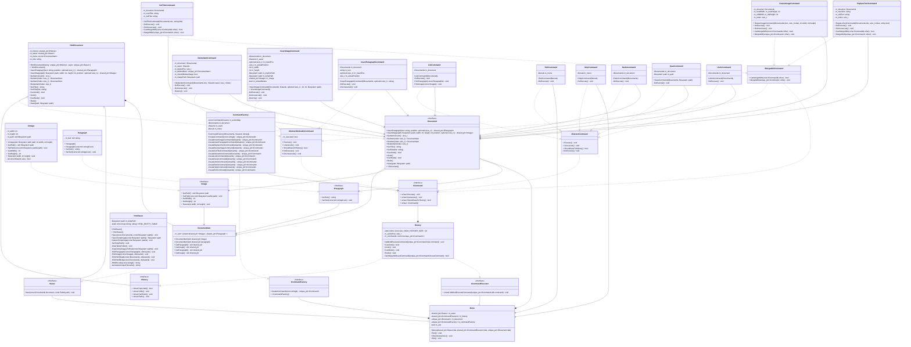

```mermaid
classDiagram
    class IDocument {
        <<interface>>
        +InsertParagraph(text: string, position: optional~size_t~) shared_ptr~IParagraph~
        +InsertImage(path: filesystem::path, width: int, height: int, position: optional~size_t~) shared_ptr~IImage~
        +GetItemsCount() size_t
        +GetItem(index: size_t) DocumentItem
        +GetItem(index: size_t) DocumentItem
        +DeleteItem(index: size_t)
        +GetTitle() string
        +SetTitle(title: string)
        +CanUndo() bool
        +Undo()
        +CanRedo() bool
        +Redo()
        +Save(path: filesystem::path)
        +~IDocument()
    }

    class HtmlDocument {
        +HtmlDocument(history: unique_ptr~IHistory~, saver: unique_ptr~ISaver~)
        +~HtmlDocument()
        +InsertParagraph(text: string, position: optional~size_t~) shared_ptr~IParagraph~
        +InsertImage(path: filesystem::path, width: int, height: int, position: optional~size_t~) shared_ptr~IImage~
        +GetItemsCount() size_t
        +GetItem(index: size_t) DocumentItem
        +GetItem(index: size_t) DocumentItem
        +DeleteItem(index: size_t)
        +GetTitle() string
        +SetTitle(title: string)
        +CanUndo() bool
        +Undo()
        +CanRedo() bool
        +Redo()
        +Save(path: filesystem::path)
        -m_history: shared_ptr~IHistory~
        -m_saver: shared_ptr~ISaver~
        -m_items: vector~DocumentItem~
        -m_title: string
    }

    class IImage {
        <<interface>>
        + GetPath() std::filesystem::path
        + SetPath(const std::filesystem::path& path) void

        + GetWidth() int
        + GetHeight() int
        + Resize(int width, int height) void
    }

    CImage ..|> IImage
    class CImage {
        + CImage(std::filesystem::path path, int width, int height)
        + GetPath() std::filesystem::path
        + SetPath(const std::filesystem::path& path) void

        + GetWidth() int
        + GetHeight() int
        + Resize(int width, int height) void

        - IsCorrectSize(int size) bool
        - m_width: int
        - m_height: int
        - m_path: std::filesystem::path
    }

    class IParagraph {
        <<interface>>
        + GetText() string
        + SetText(const std::string& text) void
    }

    Paragraph ..|> IParagraph
    class Paragraph {
        + Paragraph()
        + Paragraph(const std::string& text)
        + GetText() string
        + SetText(const std::string& text) void

        - m_text: std::string
    }

    IParagraph --> DocumentItem
    IImage --> DocumentItem
    class DocumentItem {
        + DocumentItem(std::shared_ptr<IImage> image)
        + DocumentItem(std::shared_ptr<IParagraph> paragraph)

        + GetParagraph() std::shared_ptr<IParagraph>
        + GetImage() std::shared_ptr<IImage>
        + GetParagraph() std::shared_ptr<const IParagraph>
        + GetImage() std::shared_ptr<const IImage>

        -  m_item: variant~shared_ptr~IImage~, shared_ptr~IParagraph~~ 
    }

    class IHistory {
        <<interface>>
        + virtual CanUndo() bool
        + virtual Undo() void
        + virtual CanRedo() void
        + virtual Redo() void
    }

    class ICommandExecutor {
        <<interface>>
        + virtual AddAndExecuteCommand(unqiue_ptr~ICommand~&& command) void
    }

    class History {
        + AddAndExecuteCommand(unqiue_ptr~ICommand~&& command) void
        + CanUndo() bool
        + Undo() void
        + CanRedo() void
        + Redo() void

        - CanMergeWithLastCommand(unqiue_ptr~ICommand~& newCommand) bool
        - static inline const size_t MAX_HISTORY_SIZE = 10
        - m_actionPos: size_t
        - m_commands: vector~unique_ptr~ICommand~~
    }

    class ICommand {
        <<interface>>
        + virtual Execute() void
        + virtual Unexecute() void
        + virtual ShouldSaveToHistory() bool
        + virtual ~ICommand()
    }

    class AbstractCommand {
       + Execute() void
       + Unexecute() void
       + ShouldSaveToHistory() bool

       # DoExecute() void
    }

    class AbstractUndoableCommand {
        + Execute() void
        + Unexecute() void
        + ShouldSaveToHistory() bool

        # DoExecute() void
        # DoUnexecute() void

        - m_executed: bool
    }

    class IMergeableCommand {
        + CanMergeWith(const ICommand& other) bool
        + MergeWith(unique_ptr~ICommand~ other) void
    }

    class SetTitleCommand {
        + SetTitleCommand(IDocument& doc, string title)
        + DoExecute() void
        + DoUnexecute() void
        + CanMergeWith(const ICommand& other) bool
        + MergeWith(unique_ptr~ICommand~ other) void

        - m_documet: Document&
        - m_newTitle: string
        - m_oldTitle: string
    }

    class ResizeImageCommand {
        + ResizeImageCommand(IDocument& doc, size_t index, int width, int height)
        + DoExecute() void
        + DoUnexecute() void
        + CanMergeWith(const ICommand& other) bool
        + MergeWith(unique_ptr~ICommand~ other) void

        - m_documet: Document&
        - m_newWidth, m_newHeight: int
        - m_oldWidth, m_oldHeight: int
        - m_index: size_t
    }

    class ReplaceTextCommand {
        + ReplaceTextCommand(IDocument& doc, size_t index, string text)
        + DoExecute() void
        + DoUnexecute() void
        + CanMergeWith(const ICommand& other) bool
        + MergeWith(unique_ptr~ICommand~ other) void

        - m_documet: Document&
        - m_newText: string
        - m_oldText: string
        - m_index: size_t
    }

    class DeleteItemCommand {
        + DeleteItemCommand(IDocument& doc, ISaver& saver, size_t index)

        - DoExecute() void
        - DoUnexecute() void
        - Destroy() void

        - m_document: IDocument&
        - m_saver: ISaver&
        - m_deletePos: size_t
        - m_deletedItem: unique_ptr~DocumentItem~
        - m_shouldDeleteImage: bool
        - m_imagePath: filesystem::path
    }

    class InsertImageCommand {
        -IDocument& m_document
        -ISaver& m_saver
        -optional~size_t~ m_insertPos
        -size_t m_actualPosition
        -int m_width
        -int m_height
        -filesystem::path m_imgSrcPath
        -filesystem::path m_tempPath
        -shared_ptr~IImage~ m_image
        -bool m_shouldDelete
        +InsertImageCommand(IDocument&, ISaver&, optional~size_t~, int, int, filesystem::path)
        +~InsertImageCommand()
        -DoExecute() void
        -DoUnexecute() void
        -Destroy() void
    }

    class InsertParagraphCommand {
        -IDocument& m_document
        -string m_text
        -optional~size_t~ m_insertPos
        -size_t m_actualPosition
        +InsertParagraphCommand(IDocument&, optional~size_t~, string)
        -DoExecute() void
        -DoUnexecute() void
    }

    class ListCommand {
        -IDocument& m_document
        +ListCommand(IDocument&)
        -DoExecute() void
        -PrintParagraph(const IParagraph&) void
        -PrintImage(const IImage&) void
    }

    class ExitCommand {
        -Menu& m_menu
        +ExitCommand(Menu&)
        -DoExecute() void
    }

    class HelpCommand {
        -Menu& m_menu
        +HelpCommand(Menu&)
        -DoExecute() void
    }

    class RedoCommand {
        -IDocument& m_document
        +RedoCommand(IDocument&)
        -DoExecute() void
    }

    class SaveCommand {
        -IDocument& m_document
        -filesystem::path m_path
        +SaveCommand(IDocument&, filesystem::path)
        -DoExecute() void
    }

    class UndoCommand {
        -IDocument& m_document
        +UndoCommand(IDocument&)
        -DoExecute() void
    }

    class ISaver {
        <<interface>>
        Save(const IDocument& document, const Path& path) void 
    }

    HtmlSaver ..|> ISaver
    class HtmlSaver {
        -filesystem::path m_tempPath
        -static const map~string, string~ HTML_ENTITY_TABLE
        +HtmlSaver()
        +~HtmlSaver()
        +Save(const IDocument&, const filesystem::path&) void
        +SaveTempImage(const filesystem::path&) filesystem::path
        +DeleteTempImage(const filesystem::path&) void
        -SetTempPath() void
        -ClearTempFolder() void
        -CopyTempImagesToFinal(const filesystem::path&) void
        -PrintParagraph(const IParagraph&, ofstream&) void
        -PrintImage(const IImage&, ofstream&) void
        -PrintHtmlHead(const IDocument&, ofstream&) void
        -PrintHtmlBody(const IDocument&, ofstream&) void
        -HtmlEncode(const string&) string
        -GenerateUniqueFilename() string
    }

    class ICommandFactory {
        <<interface>>
        +CreateCommand(const string&) unique_ptr~ICommand~
        +~ICommandFactory()*
    }

    CommandFactory ..|> ICommandFactory
    CommandFactory --> ICommand

    class CommandFactory {
        -const CommandCreators m_actionMap
        -IDocument& m_document
        -ISaver& m_saver
        -Menu& m_menu
        +CommandFactory(IDocument&, ISaver&, Menu&)
        +CreateCommand(const string&) unique_ptr~ICommand~
        -CreateInsertImageCommand(istream&) unique_ptr~ICommand~
        -CreateInsertParagraphCommand(istream&) unique_ptr~ICommand~
        -CreateReplaceTextCommand(istream&) unique_ptr~ICommand~
        -CreateResizeImageCommand(istream&) unique_ptr~ICommand~
        -CreateSetTitleCommand(istream&) unique_ptr~ICommand~
        -CreateDeleteItemCommand(istream&) unique_ptr~ICommand~
        -CreateListCommand(istream&) unique_ptr~ICommand~
        -CreateSaveCommand(istream&) unique_ptr~ICommand~
        -CreateUndoCommand(istream&) unique_ptr~ICommand~
        -CreateRedoCommand(istream&) unique_ptr~ICommand~
        -CreateHelpCommand(istream&) unique_ptr~ICommand~
        -CreateExitCommand(istream&) unique_ptr~ICommand~
    }

    class Menu {
        -shared_ptr~ISaver~ m_saver
        -shared_ptr~ICommandExecutor~ m_history
        -unique_ptr~IDocument~ m_document
        -unique_ptr~ICommandFactory~ m_commandFactory
        -bool m_exit
        +Menu(shared_ptr~ISaver~&&, shared_ptr~ICommandExecutor~&&, unique_ptr~IDocument~&&)
        +Run() void
        +ShowInstructions() void
        +Exit() void
    }

    HtmlDocument ..|> IDocument
    IDocument --> DocumentItem
    IDocument --> IImage
    IDocument --> IParagraph
    HtmlDocument o-- IHistory
    HtmlDocument o-- ISaver
    HtmlDocument *-- DocumentItem

    History ..|> IHistory
    History ..|> ICommandExecutor
    ICommand --* History
    AbstractUndoableCommand ..|> ICommand
    AbstractCommand ..|> ICommand
    IMergeableCommand ..|> AbstractUndoableCommand
    IMergeableCommand ..> ICommand

    SetTitleCommand ..|> IMergeableCommand
    ResizeImageCommand ..|> IMergeableCommand
    ReplaceTextCommand ..|> IMergeableCommand

    InsertParagraphCommand ..|> AbstractUndoableCommand
    InsertImageCommand ..|> AbstractUndoableCommand
    DeleteItemCommand ..|> AbstractUndoableCommand

    UndoCommand ..|> AbstractCommand
    RedoCommand ..|> AbstractCommand
    ListCommand ..|> AbstractCommand
    SaveCommand ..|> AbstractCommand
    ExitCommand ..|> AbstractCommand
    HelpCommand ..|> AbstractCommand

    HelpCommand --> Menu 
    ExitCommand --> Menu
    SetTitleCommand --> IDocument
    ResizeImageCommand --> IDocument
    ReplaceTextCommand --> IDocument
    InsertParagraphCommand --> IDocument
    InsertImageCommand --> IDocument
    DeleteItemCommand --> IDocument
    UndoCommand --> IDocument
    RedoCommand --> IDocument
    ListCommand --> IDocument
    SaveCommand --> IDocument

    ICommandFactory --* Menu 
    ISaver --o Menu 
    ICommandExecutor --o Menu 
    IDocument --* Menu

```