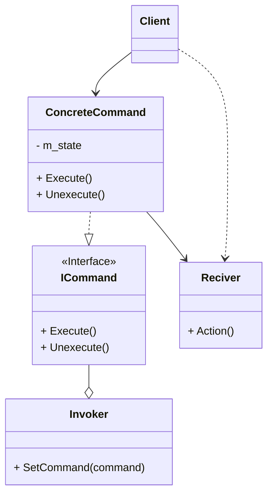

# Паттерн проектирования "Команда"

- [Дайте описание паттерна](#дайте-описание-паттерна)
- [Какие проблемы решает паттерн?](#какие-проблемы-решает-паттерн)
- [Постройте диаграмму классов этого паттерна](#постройте-диаграмму-классов-этого-паттерна)
- [Какие классы/интерфейсы участвуют в паттерне? Какую роль они играют?](#какие-классыинтерфейсы-участвуют-в-паттерне-какую-роль-они-играют)
- [Какие у паттерна есть преимущества и недостатки?](#какие-у-паттерна-есть-преимущества-и-недостатки)
- [Приведите пример использования (нарисуйте диаграмму классов)](#приведите-пример-использования-нарисуйте-диаграмму-классов)
- [Какие существуют альтернативы этому паттерну?](#какие-существуют-альтернативы-этому-паттерну)
- [Следованию каких принципов SOLID способствует применение паттерна?](#следованию-каких-принципов-solid-способствует-применение-паттерна)
- [Какие ограничения есть у паттерна?](#какие-ограничения-есть-у-паттерна)
- [Напишите пример кода, иллюстрирующий применение этого паттерна](#напишите-пример-кода-иллюстрирующий-применение-этого-паттерна)

---

## Дайте описание паттерна

**Команда** — это поведенческий паттерн проектирования, который превращает запросы в объекты,
позволяя передавать их как аргументы при вызове методов, ставить запросы в очередь, логировать их,
а также поддерживать отмену операций. 

Он инкапсулирует запрос в виде объекта, содержащего:
- Получатель запроса
- Набор действий, которые должен выполнить получатель
- Параметры запросов

## Какие проблемы решает паттерн?

Паттерн «Команда» решает проблему разделения объекта, вызывающего операцию, от объекта, выполняющего эту операцию.

Возможности:
- Отмена и повтор действий
- Регистрация запросов
- Отложенное выполнение запросов


## Постройте диаграмму классов этого паттерна.



## Какие классы/интерфейсы участвуют в паттерне? Какую роль они играют?

**Клиент**. Отвечает за создание конкретной команды и назначение Получателя

**Получатель**. Умеет исполнять операции, необходимые для запроса
В роли Получателя может выступать любой класс

**Инициатор**. Хранит команду и в определенный момент выполняет её, вызывая Execute()

**Команда**. Объявляет интерфейс, общий для всех команд. 
Помимо Execute() может объявлять и другие методы

**Конкретная команда**. Связывает операции с Получателем.
Инициатор выдает запрос, вызывая Execute(). ConcreteCommand выполняет его, активизируя операции Получателя

## Какие у паттерна есть преимущества и недостатки?

**Преиммущества**
- Убирает прямую зависимость между объектами, вызывающими операции, и объектами, которые их непосредственно выполняют.
- Позволяет реализовать простую отмену и повтор операций.
- Позволяет реализовать отложенный запуск операций.
- Позволяет собирать сложные команды из простых.
- Реализует принцип открытости/закрытости.

**Недостатки**
- Усложняет код программы из-за введения множества дополнительных классов.

## Приведите пример использования (нарисуйте диаграмму классов).

---

## Какие существуют альтернативы этому паттерну?

Паттерн Стратегия, Паттерн Прортотип, Паттерн Посетитель

## Следованию каких принципов SOLID способствует применение паттерна?

Принцип открытости/закрытости

## Какие ограничения есть у паттерна?

- Усложнение кода: Увеличивает количество классов в системе
- Накладные расходы: Дополнительные слои абстракции могут снизить производительность
- Сложность отладки: Цепочка вызовов становится более сложной для трассировки
- Избыточность: Для простых операций может быть излишним
- Память: Требуется хранение состояния для реализации undo/redo

## Напишите пример кода, иллюстрирующий применение этого паттерна.

### ICommand.hpp
```cpp
#pragma once

class ICommand
{
public:
    virtual ~ICommand() = default;
    virtual void Execute() = 0;
    virtual void Undo() = 0;
};
```

### Devices.h
```cpp
#pragma once
#include <iostream>
#include <string>

class Light 
{
private:
    std::string m_location;

public:
    explicit Light(const std::string& location = "Unknown") 
        : m_location(location) {}

    void TurnOn() 
    {
        std::cout << m_location << " свет включен" << std::endl;
    }
    
    void TurnOff()
    {
        std::cout << m_location << " свет выключен" << std::endl;
    }

    std::string GetLocation() const { return m_location; }
};

class TV 
{
private:
    std::string m_location;
    int m_currentChannel;

public:
    explicit TV(const std::string& location = "Unknown") 
        : m_location(location), m_currentChannel(1) {}

    void TurnOn() 
    {
        std::cout << m_location << " телевизор включен" << std::endl;
    }
    
    void TurnOff() 
    {
        std::cout << m_location << " телевизор выключен" << std::endl;
    }
    
    void SetChannel(int channel) 
    {
        m_currentChannel = channel;
        std::cout << m_location << " телевизор: канал установлен на " << channel << std::endl;
    }

    int GetCurrentChannel() const { return m_currentChannel; }
    std::string GetLocation() const { return m_location; }
};
```

### LightsCommands.h
```cpp
#pragma once
#include "ICommand.h"
#include "Devices.h"

class LightOnCommand : public ICommand 
{
private:
    Light* m_light;

public:
    explicit LightOnCommand(Light* light) : m_light(light) {}

    void Execute() override 
    {
        if (m_light) 
        {
            m_light->TurnOn();
        }
    }
    
    void Undo() override 
    {
        if (m_light) 
        {
            m_light->TurnOff();
        }
    }
};

class LightOffCommand : public ICommand 
{
private:
    Light* m_light;

public:
    explicit LightOffCommand(Light* light) : m_light(light) {}

    void Execute() override 
    {
        if (m_light) 
        {
            m_light->TurnOff();
        }
    }
    
    void Undo() override 
    {
        if (m_light) 
        {
            m_light->TurnOn();
        }
    }
};
```

### TVCommands.h
```cpp
#pragma once
#include "ICommand.h"
#include "Devices.h"

class TVOnCommand : public ICommand 
{
private:
    TV* m_tv;
    int m_previousChannel;

public:
    explicit TVOnCommand(TV* tv) : m_tv(tv), m_previousChannel(1) {}

    void Execute() override 
    {
        if (m_tv) 
        {
            m_previousChannel = m_tv->GetCurrentChannel();
            m_tv->TurnOn();
            m_tv->SetChannel(1);
        }
    }
    
    void Undo() override 
    {
        if (m_tv) 
        {
            m_tv->TurnOff();
            m_tv->SetChannel(m_previousChannel);
        }
    }
};

class TVSetChannelCommand : public ICommand 
{
private:
    TV* m_tv;
    int m_channel;
    int m_previousChannel;

public:
    explicit TVSetChannelCommand(TV* tv, int channel) 
        : m_tv(tv), m_channel(channel), m_previousChannel(1) {}

    void Execute() override 
    {
        if (m_tv) 
        {
            m_previousChannel = m_tv->GetCurrentChannel();
            m_tv->SetChannel(m_channel);
        }
    }
    
    void Undo() override 
    {
        if (m_tv) 
        {
            m_tv->SetChannel(m_previousChannel);
        }
    }
};
```

### MacroCommand.h
```cpp
#pragma once
#include "ICommand.h"
#include <vector>
#include <memory>

class AllDevicesOnCommand : public ICommand 
{
private:
    std::vector<std::unique_ptr<ICommand>> m_commands;

public:
    explicit AllDevicesOnCommand(std::vector<std::unique_ptr<ICommand>> commands) 
        : m_commands(std::move(commands)) {}

    void Execute() override 
    {
        for (auto& command : m_commands) 
        {
            command->Execute();
        }
    }
    
    void Undo() override 
    {
        for (auto it = m_commands.rbegin(); it != m_commands.rend(); ++it) 
        {
            (*it)->Undo();
        }
    }
};
```

### RemoteControl.h
```cpp
#pragma once
#include "ICommand.h"
#include <memory>
#include <stack>
#include <iostream>

class RemoteControl {
private:
    std::stack<std::unique_ptr<ICommand>> m_commandHistory;

public:
    void ExecuteCommand(std::unique_ptr<ICommand> command) 
    {
        if (command) 
        {
            command->Execute();
            m_commandHistory.push(std::move(command));
        }
    }
    
    void UndoLastCommand() 
    {
        if (!m_commandHistory.empty()) 
        {
            auto command = std::move(m_commandHistory.top());
            m_commandHistory.pop();
            command->Undo();
        } else 
        {
            std::cout << "Нет команд для отмены" << std::endl;
        }
    }
    
    size_t GetHistorySize() const 
    {
        return m_commandHistory.size();
    }
    
    void ClearHistory() 
    {
        while (!m_commandHistory.empty()) 
        {
            m_commandHistory.pop();
        }
    }
};
```

### main.cpp
```cpp
#include <iostream>
#include <memory>
#include <vector>

#include "ICommand.h"
#include "Devices.h"
#include "LightCommands.h"
#include "TVCommands.h"
#include "MacroCommand.h"
#include "RemoteControl.h"

int main() 
{
    setlocale(LC_ALL, "RU");

    std::cout << "=== Демонстрация паттерна Команда ===" << std::endl;
    
    Light livingRoomLight("Гостиная");
    Light kitchenLight("Кухня");
    TV livingRoomTV("Гостиная");
    
    RemoteControl remote;

    std::cout << "\n=== Тестирование отдельных команд ===" << std::endl;
    
    auto lightOn = std::make_unique<LightOnCommand>(&livingRoomLight);
    remote.ExecuteCommand(std::move(lightOn));
    
    auto tvOn = std::make_unique<TVOnCommand>(&livingRoomTV);
    remote.ExecuteCommand(std::move(tvOn));
    
    auto changeChannel = std::make_unique<TVSetChannelCommand>(&livingRoomTV, 5);
    remote.ExecuteCommand(std::move(changeChannel));
    
    std::cout << "\n=== Тестирование отмены ===" << std::endl;
    remote.UndoLastCommand(); // Отмена смены канала
    remote.UndoLastCommand(); // Отмена включения TV
    remote.UndoLastCommand(); // Отмена включения света
    
    std::cout << "\n=== Тестирование макрокоманды ===" << std::endl;
    
    std::vector<std::unique_ptr<ICommand>> commands;
    commands.push_back(std::make_unique<LightOnCommand>(&livingRoomLight));
    commands.push_back(std::make_unique<LightOnCommand>(&kitchenLight));
    commands.push_back(std::make_unique<TVOnCommand>(&livingRoomTV));
    
    auto allDevicesOn = std::make_unique<AllDevicesOnCommand>(std::move(commands));
    remote.ExecuteCommand(std::move(allDevicesOn));
    
    std::cout << "\n=== Отмена макрокоманды ===" << std::endl;
    remote.UndoLastCommand();
    
    std::cout << "\n=== Тестирование сценария использования ===" << std::endl;
    
    // Вечерний сценарий
    std::cout << "Вечерний режим:" << std::endl;
    remote.ExecuteCommand(std::make_unique<LightOnCommand>(&livingRoomLight));
    remote.ExecuteCommand(std::make_unique<TVOnCommand>(&livingRoomTV));
    remote.ExecuteCommand(std::make_unique<TVSetChannelCommand>(&livingRoomTV, 8));
    
    std::cout << "\nПодготовка ко сну:" << std::endl;
    while (remote.GetHistorySize() > 0)
    {
        remote.UndoLastCommand();
    }
    
    return EXIT_SUCCESS;
}
```