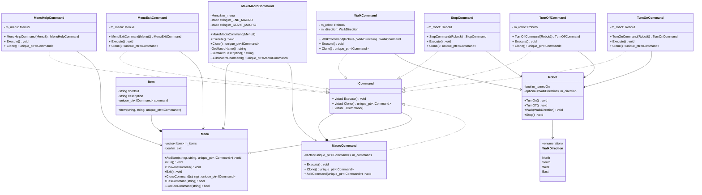

```mermaid
classDiagram   
    class WalkDirection {
        <<enumeration>>
        North
        South
        West
        East
    }
    class Robot {
        -bool m_turnedOn
        -optional~WalkDirection~ m_direction
        +TurnOn() void
        +TurnOff() void
        +Walk(WalkDirection) void
        +Stop() void
    }
    class Menu {
        -vector~Item~ m_items
        -bool m_exit
        +AddItem(string, string, unique_ptr~ICommand~) void
        +Run() void
        +ShowInstructions() void
        +Exit() void
        +CloneCommand(string) unique_ptr~ICommand~
        +HasCommand(string) bool
        -ExecuteCommand(string) bool
    }
    class Item {
        -string shortcut
        -string description
        -unique_ptr~ICommand~ command
        +Item(string, string, unique_ptr~ICommand~)
    }
    class ICommand {
        + virtual Execute() void
        + virtual Clone() unique_ptr~ICommand~
        + virtual ~ICommand() 
    }
    class WalkCommand {
        + WalkCommand(Robot&, WalkDirection) WalkCommand
        + Execute() void
        + Clone() unique_ptr~ICommand~
        - m_robot: Robot&
        - m_direction: WalkDirection
    }
    class StopCommand {
        + StopCommand(Robot&) StopCommand
        + Execute() void
        + Clone() unique_ptr~ICommand~
        - m_robot: Robot&
    }
    class TurnOffCommand {
        + TurnOffCommand(Robot&) TurnOffCommand
        + Execute() void
        + Clone() unique_ptr~ICommand~
        - m_robot: Robot&
    }
    class TurnOnCommand {
        + TurnOnCommand(Robot&) TurnOnCommand
        + Execute() void
        + Clone() unique_ptr~ICommand~
        - m_robot: Robot&
    }
    class MenuHelpCommand {
        + MenuHelpCommand(Menu&) MenuHelpCommand
        + Execute() void
        + Clone() unique_ptr~ICommand~
        - m_menu: Menu&
    }
    class MenuExitCommand {
        + MenuExitCommand(Menu&) MenuExitCommand
        + Execute() void
        + Clone() unique_ptr~ICommand~
        - m_menu: Menu&
    }

    class MacroCommand {
        -vector~unique_ptr~ICommand~~ m_commands
        + Execute() void
        + Clone() unique_ptr~ICommand~
        + AddCommand(unique_ptr~ICommand~) void
    }

    class MakeMacroCommand {
        -Menu& m_menu
        -static string m_END_MACRO
        -static string m_START_MACRO
        +MakeMacroCommand(Menu&)
        +Execute() void
        +Clone() unique_ptr~ICommand~
        -GetMacroName() string
        -GetMacroDescription() string
        -BuildMacroCommand() unique_ptr~MacroCommand~
    }

    Item --* Menu
    WalkCommand ..|> ICommand
    StopCommand ..|> ICommand
    TurnOffCommand ..|> ICommand
    TurnOnCommand ..|> ICommand
    MenuHelpCommand ..|> ICommand
    MenuExitCommand ..|> ICommand
    MacroCommand ..|> ICommand
    MakeMacroCommand ..|> ICommand
    WalkCommand --> Robot
    StopCommand --> Robot
    TurnOffCommand --> Robot
    TurnOnCommand --> Robot
    MenuExitCommand --> Menu
    MenuHelpCommand --> Menu
    MakeMacroCommand --> Menu
    MakeMacroCommand --> MacroCommand
    Robot --> WalkDirection
    ICommand --* MacroCommand
    ICommand --o Menu
```