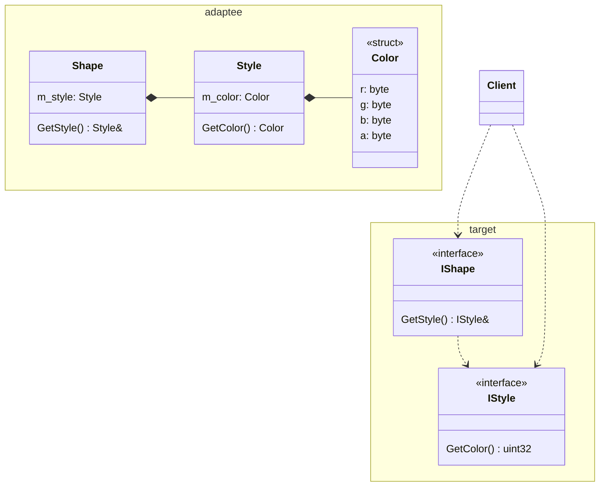

# Паттерн проектирования "Адаптер"
- Дайте описание паттерна
- Какие проблемы решает паттерн?
- Постройте диаграмму классов этого паттерна (в вариациях "Адаптер объекта" и "Адаптер класса").
- Чем отличается "Адаптер объекта" от "Адаптера класса"? Почему у этих классов такие названия?
- Какие классы/интерфейсы участвуют в паттерне? Какую роль они играют?
- Какие у паттерна есть преимущества и недостатки?
- Приведите пример использования (нарисуйте диаграмму классов).
- Какие существуют альтернативы этому паттерну?
- Следованию каких принципов SOLID способствует применение паттерна?
- Какие ограничения есть у паттерна?
- Напишите пример кода, иллюстрирующий применение этого паттерна.
- Напишите адаптер, адаптирующий объекты `adaptee` к интерфейсам `target`. См. диаграмму классов:
