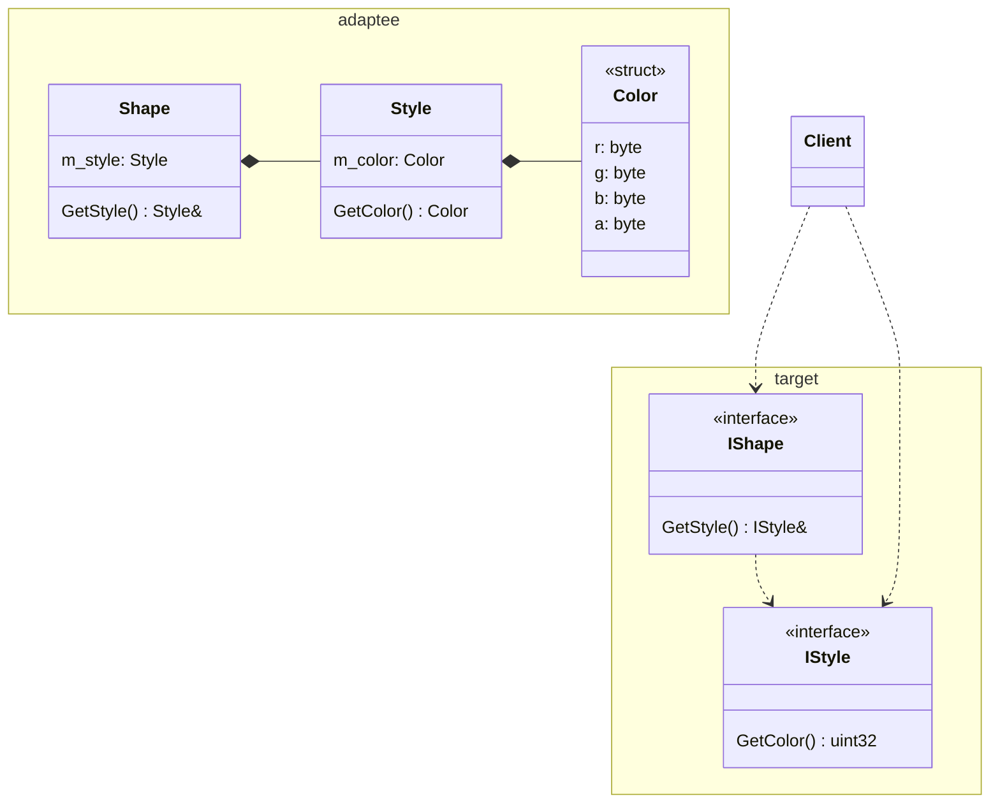
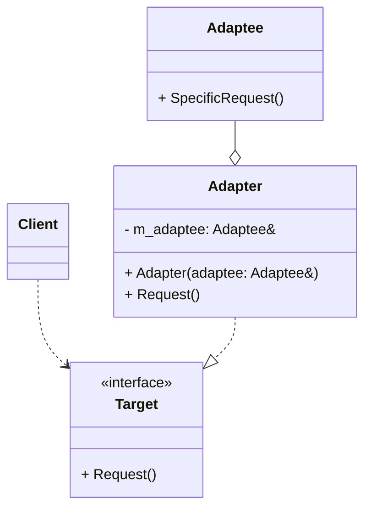
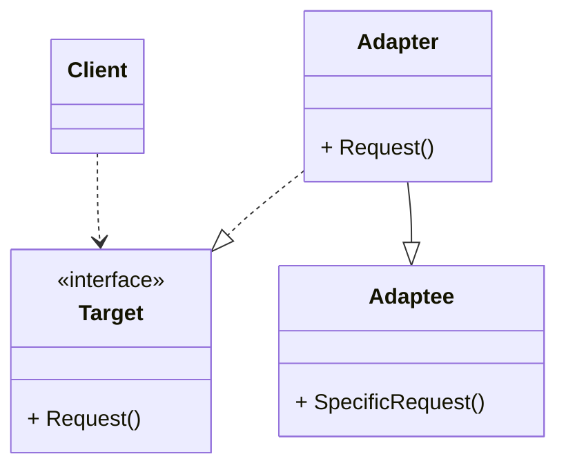

# Паттерн проектирования "Адаптер"

- [Паттерн проектирования "Адаптер"](#паттерн-проектирования-адаптер)
  - [Дайте описание паттерна](#дайте-описание-паттерна)
  - [Какие проблемы решает паттерн?](#какие-проблемы-решает-паттерн)
  - [Постройте диаграмму классов этого паттерна (в вариациях "Адаптер объекта" и "Адаптер класса")](#постройте-диаграмму-классов-этого-паттерна-в-вариациях-адаптер-объекта-и-адаптер-класса)
    - [Адаптер объекта](#адаптер-объекта)
    - [Адаптер класса](#адаптер-класса)
  - [Чем отличается "Адаптер объекта" от "Адаптера класса"? Почему у этих классов такие названия?](#чем-отличается-адаптер-объекта-от-адаптера-класса-почему-у-этих-классов-такие-названия)
  - [Какие классы/интерфейсы участвуют в паттерне? Какую роль они играют?](#какие-классыинтерфейсы-участвуют-в-паттерне-какую-роль-они-играют)
  - [Какие у паттерна есть преимущества и недостатки?](#какие-у-паттерна-есть-преимущества-и-недостатки)
  - [Приведите пример использования (нарисуйте диаграмму классов)](#приведите-пример-использования-нарисуйте-диаграмму-классов)
  - [Какие существуют альтернативы этому паттерну?](#какие-существуют-альтернативы-этому-паттерну)
  - [Следованию каких принципов SOLID способствует применение паттерна?](#следованию-каких-принципов-solid-способствует-применение-паттерна)
  - [Какие ограничения есть у паттерна?](#какие-ограничения-есть-у-паттерна)
  - [Напишите пример кода, иллюстрирующий применение этого паттерна](#напишите-пример-кода-иллюстрирующий-применение-этого-паттерна)
  - [Напишите адаптер, адаптирующий объекты `adaptee` к интерфейсам `target`](#напишите-адаптер-адаптирующий-объекты-adaptee-к-интерфейсам-target)

## Дайте описание паттерна

**Адаптер** - структурный паттерн проектирования, который преобразует интерфейс класса к другому интерфейсу, использующегося клиентами 

## Какие проблемы решает паттерн?

- Обеспечивает совместную работу классов, невозможную в обычных условиях из-за несовместимости интерфейсов
- Адаптер защищает код клиента от изменений в используемом интерфейсе

## Постройте диаграмму классов этого паттерна (в вариациях "Адаптер объекта" и "Адаптер класса")

### Адаптер объекта

### Адаптер класса

Отличный план для конспекта! Вот подробные ответы на все ваши вопросы о паттерне "Адаптер".

---

## Чем отличается "Адаптер объекта" от "Адаптера класса"? Почему у этих классов такие названия?

Разница заключается в **механизме реализации** и в том, **на что ссылается адаптер**.

| Характеристика | Адаптер объекта (Композиция) | Адаптер класса (Наследование) |
| :--- | :--- | :--- |
| **Механизм** | Адаптер содержит **ссылку** на объект адаптируемого класса (**композиция**). | Адаптер **наследует** и от целевого интерфейса, и от адаптируемого класса (**множественное наследование**). |
| **Связь** | "Имеет" объект адаптируемого класса. | "Является" и целевым интерфейсом, и адаптируемым классом. |
| **Гибкость** | **Высокая**. Может адаптировать сам класс и его подклассы. | **Низкая**. Жестко привязан к конкретному классу. |
| **Название** | Назван так, потому что работает с **конкретным объектом** (адаптирует его). | Назван так, потому что адаптирует целый **класс** через наследование. |

**Почему такие названия?**
*   **Адаптер объекта** имеет дело с конкретным *объектом*, который он "оборачивает".
*   **Адаптер класса** работает на уровне *класса*, расширяя его функциональность через наследование.

> **Важно:** В языках без множественного наследования (как Java, C#) **Адаптер класса невозможен**. Поэтому на практике **Адаптер объекта** используется гораздо чаще и является более гибким решением.

## Какие классы/интерфейсы участвуют в паттерне? Какую роль они играют?

1.  **`Client` (Клиент)**:
    *   **Роль:** Класс, который использует целевой интерфейс для своей работы. Он не знает о существовании Адаптера или Адаптируемого класса.

2.  **`Target` (Целевой интерфейс)**:
    *   **Роль:** Определяет интерфейс, который ожидает и понимает `Client`. Это тот "язык", на котором говорит клиент.

3.  **`Adapter` (Адаптер)**:
    *   **Роль:** Главный компонент паттерна. Реализует интерфейс `Target` и "переводит" запросы от клиента в форму, понятную для `Adaptee`. Содержит ссылку на объект `Adaptee` (в объектном адаптере) или наследуется от него (в классовом адаптере).

4.  **`Adaptee` (Адаптируемый класс)**:
    *   **Роль:** Существующий класс с полезной функциональностью, но с несовместимым интерфейсом. Это "старая" система, которую нужно интегрировать.

## Какие у паттерна есть преимущества и недостатки?

**Преимущества (`Pros`):**

*   **`Single Responsibility Principle`:** Отделяет код преобразования интерфейса от основной бизнес-логики.
*   **`Open/Closed Principle`:** Позволяет вводить в программу новые классы с несовместимыми интерфейсами, не ломая существующий клиентский код.
*   **Повторное использование кода:** Позволяет использовать существующие классы, даже если их интерфейс не соответствует вашим нуждам.

**Недостатки (`Cons`):**

*   **Усложнение кода:** Вводит дополнительные классы и интерфейсы. Иногда проще просто изменить сервисный класс, чтобы он соответствовал остальной системе.
*   **"Транслятор" может стать сложным:** Если интерфейсы `Target` и `Adaptee` сильно отличаются, код Адаптера может стать очень запутанным.

---

## Приведите пример использования (нарисуйте диаграмму классов)

## Какие существуют альтернативы этому паттерну?

1.  **Изменение сервисного класса (`Adaptee`):**
    *   Если возможно, просто измените код `Adaptee`, чтобы он соответствовал требуемому интерфейсу. Это самое простое решение, но часто невозможное (закрытый код, библиотека).

2.  **Паттерн "Фасад":**
    *   Фасад упрощает сложную подсистему, предоставляя простой интерфейс. В отличие от Адаптера, который *преобразует* один интерфейс в другой, Фасад *упрощает* доступ к множеству интерфейсов.

3.  **Изменение клиентского кода (`Client`):**
    *   Иногда проще научить `Client` работать с интерфейсом `Adaptee` напрямую. Это может быть уместно, если `Adaptee` используется только в одном месте.

## Следованию каких принципов SOLID способствует применение паттерна?

1.  **`S` (Single Responsibility Principle - Принцип единственной ответственности):**
    *   Адаптер берет на себя **единственную обязанность** — преобразование интерфейсов. Логика `Adaptee` и логика `Client` остаются чистыми и не знают о преобразовании.

2.  **`O` (Open/Closed Principle - Принцип открытости/закрытости):**
    *   Система становится **открыта для расширения** (мы можем добавлять новые адаптеры для новых несовместимых классов), но **закрыта для изменений** (нам не нужно менять существующий код `Client` или `Target`).

3.  **`L` (Liskov Substitution Principle - Принцип подстановки Барбары Лисков):**
    *   Адаптер является подтипом `Target`, поэтому клиентский код может работать с ним, не зная о подмене. Это прямое следование LSP.

4.  **`I` (Interface Segregation Principle - Принцип разделения интерфейса):**
    *   Паттерн косвенно способствует ISP, так как `Target` должен быть целенаправленным и клиентоориентированным. Если `Target` слишком велик, Адаптеру придется реализовывать много ненужных методов, что является запахом плохого дизайна.

## Какие ограничения есть у паттерна?

*   **Сложность адаптации сильно различающихся интерфейсов.** Если `Target` и `Adaptee` делают принципиально разные вещи (например, один рисует графику, а другой работает с базой данных), Адаптер не сможет "сотворить чудо". Его задача — привести к совместимости, а не изменить саму сущность.
*   **Накладные расходы.** Введение дополнительного слоя (Адаптера) всегда немного замедляет выполнение программы, хотя в большинстве случаев это пренебрежимо мало.
*   **Риск создания "Богатого" Адаптера.** Адаптер может превратиться в "мусорное ведро" для всякой логики, связанной с преобразованием, нарушая SRP. Его задача — только трансляция вызовов.

## Напишите пример кода, иллюстрирующий применение этого паттерна

## Напишите адаптер, адаптирующий объекты `adaptee` к интерфейсам `target`