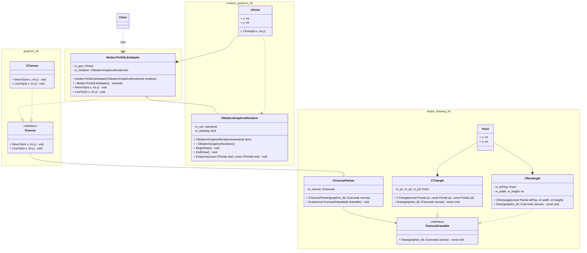

```mermaid
classDiagram
    namespace app {
        class ModernToOldLibAdapter {
            + ModernToOldLibAdapter(CModernGraphicsRenderer& renderer)
            + ~ModernToOldLibAdapter() override;

            + MoveTo(int x, int y) void
            + LineTo(int x, int y) void

            - m_pos: CPoint
            - m_renderer: CModernGraphicsRenderer&;
        }
    }

    Client ..> ModernToOldLibAdapter : Use
    CPoint --* ModernToOldLibAdapter
    ModernToOldLibAdapter ..|> ICanvas
    ModernToOldLibAdapter o-- CModernGraphicsRenderer


    namespace graphics_lib {
        class ICanvas {
            <<interface>>
            + MoveTo(int x, int y) void
            + LineTo(int x, int y) void
        }

        class CCanvas {
            + MoveTo(int x, int y) void
            + LineTo(int x, int y) void
        }
    }
    CCanvas ..|> ICanvas

    namespace modern_graphics_lib {
        class CPoint {
            + CPoint(int x, int y)
            + x: int
            + y: int
        }

        class CModernGraphicsRenderer {
            + CModernGraphicsRenderer(ostream& strm)
            + ~CModernGraphicsRenderer()
            + BeginDraw() void
            + EndDraw() void
            + DrawLine(const CPoint& start, const CPoint& end) void
            - m_out: ostream&
            - m_drawing: bool
        }
    }
    CPoint ..> CModernGraphicsRenderer

    namespace shape_drawing_lib {
        class Point {
            + x: int
            + y: int 
        }

        class ICanvasDrawable {
            <<interface>>
            + Draw(graphics_lib::ICanvas& canvas) const void
        }

        class CTriangle {
            + CTriangle(const Point& p1, const Point& p2, const Point& p3)
            + Draw(graphics_lib::ICanvas& canvas) const void

            - m_p1, m_p2, m_p3: Point
        }

        class CRectangle {
            + CRectangle(const Point& leftTop, int width, int height)
            + Draw(graphics_lib::ICanvas& canvas) const void

            - m_leftTop: Point
            - m_width, m_height: int
        }

        class CCanvasPainter {
            + CCanvasPainter(graphics_lib::ICanvas& canvas)
            + Draw(const ICanvasDrawable& drawable) void
            - m_canvas: ICanvas&
        }
    }

    CCanvasPainter --> ICanvasDrawable
    ICanvas --o CCanvasPainter
    Point --* CTriangle
    Point --* CRectangle
    CTriangle ..|> ICanvasDrawable
    CRectangle ..|> ICanvasDrawable
```