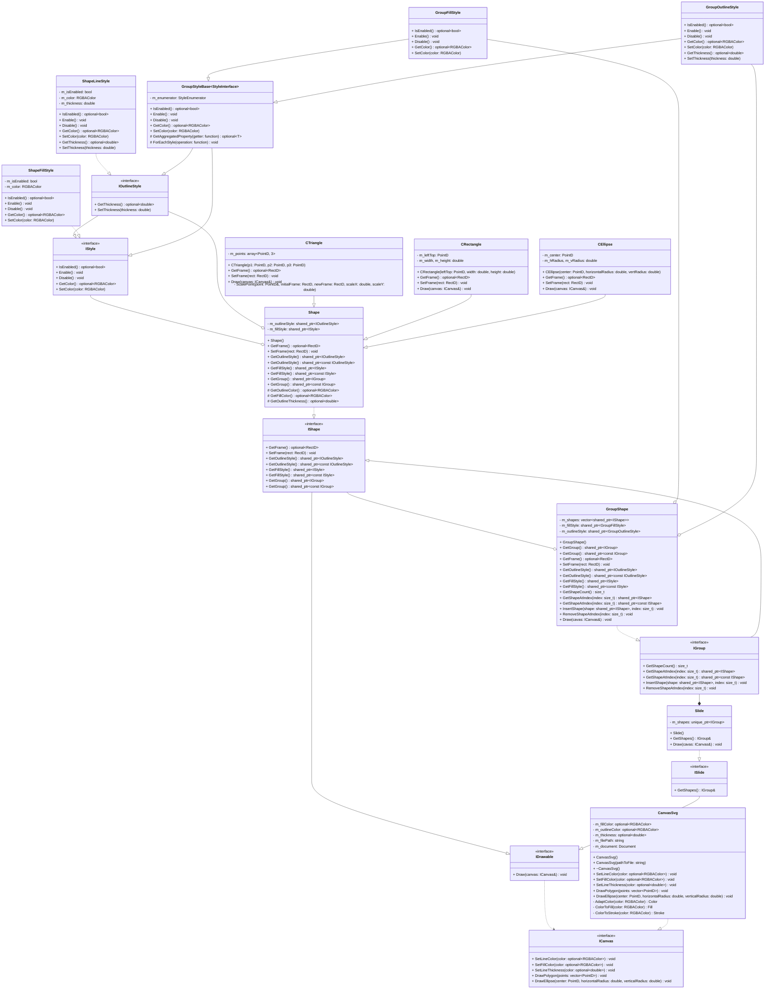

```mermaid
classDiagram
    class IStyle {
        <<interface>>
        + IsEnabled() optional~bool~
        + Enable() void
        + Disable() void
        + GetColor() optional~RGBAColor~
        + SetColor(color: RGBAColor)
    }

    class IOutlineStyle {
        <<interface>>
        + GetThickness() optional~double~
        + SetThickness(thickness: double)
    }

    class ShapeFillStyle {
        + IsEnabled() optional~bool~
        + Enable() void
        + Disable() void
        + GetColor() optional~RGBAColor~
        + SetColor(color: RGBAColor)
        - m_isEnabled: bool
        - m_color: RGBAColor
    }

    class ShapeLineStyle {
        + IsEnabled() optional~bool~
        + Enable() void
        + Disable() void
        + GetColor() optional~RGBAColor~
        + SetColor(color: RGBAColor)
        + GetThickness() optional~double~
        + SetThickness(thickness: double)
        - m_isEnabled: bool
        - m_color: RGBAColor
        - m_thickness: double
    }

    class GroupStyleBase~StyleInterface~ {
        + IsEnabled() optional~bool~
        + Enable() void
        + Disable() void
        + GetColor() optional~RGBAColor~
        + SetColor(color: RGBAColor)
        # GetAggregatedProperty(getter: function) optional~T~
        # ForEachStyle(operation: function) void
        - m_enumerator: StyleEnumerator
    }

    class GroupFillStyle {
        + IsEnabled() optional~bool~
        + Enable() void
        + Disable() void
        + GetColor() optional~RGBAColor~
        + SetColor(color: RGBAColor)
    }

    class GroupOutlineStyle {
        + IsEnabled() optional~bool~
        + Enable() void
        + Disable() void
        + GetColor() optional~RGBAColor~
        + SetColor(color: RGBAColor)
        + GetThickness() optional~double~
        + SetThickness(thickness: double)
    }

    class ICanvas {
        <<interface>>
        + SetLineColor(color: optional~RGBAColor~) void
        + SetFillColor(color: optional~RGBAColor~) void
        + SetLineThickness(color: optional~double~) void
        + DrawPolygon(points: vector~PointD~) void
        + DrawEllipse(center: PointD, horizontalRadius: double, verticalRadius: double) void
    }

    class CanvasSvg {
        + CanvasSvg()
        + CanvasSvg(pathToFile: string)
        + ~CanvasSvg()

        + SetLineColor(color: optional~RGBAColor~) void
        + SetFillColor(color: optional~RGBAColor~) void
        + SetLineThickness(color: optional~double~) void
        + DrawPolygon(points: vector~PointD~) void
        + DrawEllipse(center: PointD, horizontalRadius: double, verticalRadius: double) void

        - AdaptColor(color: RGBAColor) Color
        - ColorToFill(color: RGBAColor) Fill
        - ColorToStroke(color: RGBAColor) Stroke

        - m_fillColor: optional~RGBAColor~
        - m_outlineColor: optional~RGBAColor~
        - m_thickness: optional~double~
        - m_filePath: string
        - m_document: Document
    }

    class IDrawable {
        <<interface>>
        + Draw(canvas: ICanvas&) void
    }

    class IShape {
        <<interface>>
        + GetFrame() optional~RectD~
        + SetFrame(rect: RectD) void
        + GetOutlineStyle() shared_ptr~IOutlineStyle~
        + GetOutlineStyle() shared_ptr~const IOutlineStyle~
        + GetFillStyle() shared_ptr~IStyle~
        + GetFillStyle() shared_ptr~const IStyle~
        + GetGroup() shared_ptr~IGroup~
        + GetGroup() shared_ptr~const IGroup~
    }

    class Shape {
        + Shape()

        + GetFrame() optional~RectD~
        + SetFrame(rect: RectD) void
        + GetOutlineStyle() shared_ptr~IOutlineStyle~
        + GetOutlineStyle() shared_ptr~const IOutlineStyle~
        + GetFillStyle() shared_ptr~IStyle~
        + GetFillStyle() shared_ptr~const IStyle~
        + GetGroup() shared_ptr~IGroup~
        + GetGroup() shared_ptr~const IGroup~

        # GetOutlineColor() optional~RGBAColor~
        # GetFillColor() optional~RGBAColor~
        # GetOutlineThickness() optional~double~

        - m_outlineStyle: shared_ptr~IOutlineStyle~
        - m_fillStyle: shared_ptr~IStyle~
    }

    class CTriangle {
        + CTriangle(p1: PointD, p2: PointD, p3: PointD)
        + GetFrame() optional~RectD~
        + SetFrame(rect: RectD) void
        + Draw(canvas: ICanvas&) void

        - ScalePoint(point: PointD&, initialFrame: RectD, newFrame: RectD, scaleX: double, scaleY: double)
        - m_points: array~PointD, 3~
    }

    class CRectangle {
        + CRectangle(leftTop: PointD, width: double, height: double)
        + GetFrame() optional~RectD~
        + SetFrame(rect: RectD) void
        + Draw(canvas: ICanvas&) void

        - m_leftTop: PointD
        - m_width, m_height: double
    }

    class CEllipse {
        + CEllipse(center: PointD, horizontalRadius: double, vertRadius: double)
        + GetFrame() optional~RectD~
        + SetFrame(rect: RectD) void
        + Draw(canvas: ICanvas&) void

        - m_center: PointD
        - m_hRadius, m_vRadius: double
    }

    class IGroup {
        <<interface>>
        + GetShapeCount() size_t
        + GetShapeAtIndex(index: size_t) shared_ptr~IShape~
        + GetShapeAtIndex(index: size_t) shared_ptr~const IShape~
        + InsertShape(shape: shared_ptr~IShape~, index: size_t) void
        + RemoveShapeAtIndex(index: size_t) void
    }

    class GroupShape {
        + GroupShape()

        + GetGroup() shared_ptr~IGroup~
        + GetGroup() shared_ptr~const IGroup~

        + GetFrame() optional~RectD~
        + SetFrame(rect: RectD) void

        + GetOutlineStyle() shared_ptr~IOutlineStyle~
        + GetOutlineStyle() shared_ptr~const IOutlineStyle~

        + GetFillStyle() shared_ptr~IStyle~
        + GetFillStyle() shared_ptr~const IStyle~
        
        + GetShapeCount() size_t
        + GetShapeAtIndex(index: size_t) shared_ptr~IShape~
        + GetShapeAtIndex(index: size_t) shared_ptr~const IShape~

        + InsertShape(shape: shared_ptr~IShape~, index: size_t) void
        + RemoveShapeAtIndex(index: size_t) void
        + Draw(cavas: ICanvas&) void

        - m_shapes: vector~shared_ptr~IShape~~
        - m_fillStyle: shared_ptr~GroupFillStyle~
        - m_outlineStyle: shared_ptr~GroupOutlineStyle~
    }

    class ISlide {
        <<interface>>
        + GetShapes() IGroup&
    }

    class Slide {
        + Slide()
        + GetShapes() IGroup&
        + Draw(cavas: ICanvas&) void

        - m_shapes: unique_ptr~IGroup~
    }

    IShape --|> IDrawable
    IDrawable ..> ICanvas
    CanvasSvg ..|> ICanvas

    ISlide --|> IDrawable
    Slide ..|> ISlide
    IGroup --* Slide

    Shape ..|> IShape
    IStyle --o Shape
    IOutlineStyle --o Shape

    CTriangle --|> Shape
    CRectangle --|> Shape
    CEllipse --|> Shape

    IGroup --|> IShape
    GroupShape ..|> IGroup
    IShape --o GroupShape
    GroupFillStyle --o GroupShape
    GroupOutlineStyle --o GroupShape

    IOutlineStyle --|> IStyle
    ShapeFillStyle ..|> IStyle
    ShapeLineStyle ..|> IOutlineStyle
    GroupStyleBase~IStyle~ --|> IStyle
    GroupStyleBase~IOutlineStyle~ --|> IOutlineStyle
    GroupFillStyle --|> GroupStyleBase~IStyle~
    GroupOutlineStyle --|> GroupStyleBase~IOutlineStyle~
```