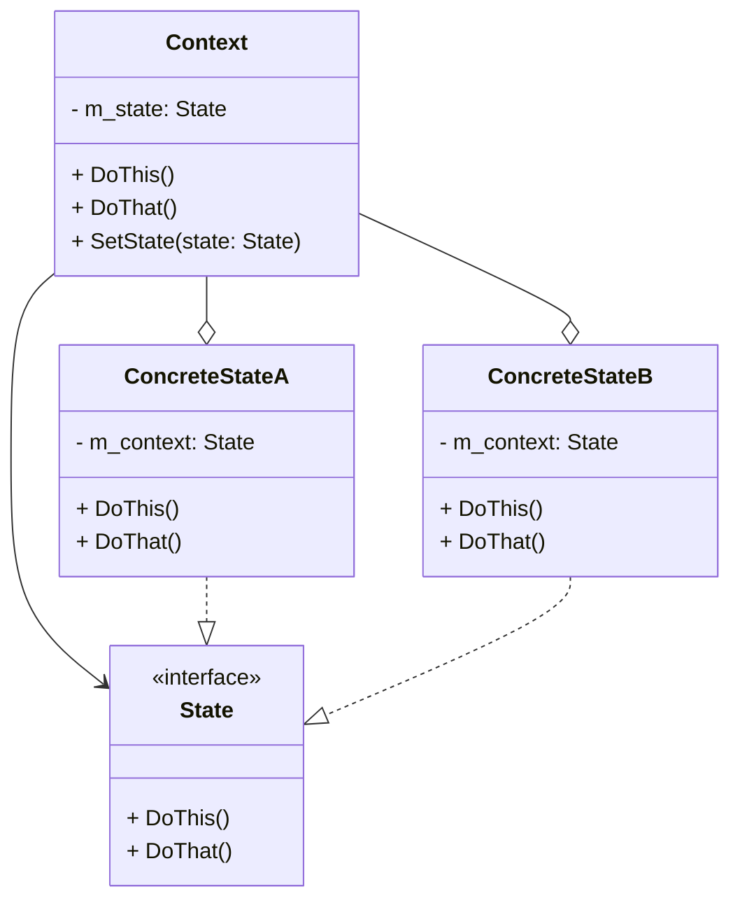

# Паттерн проектирования "Состояние"

- [Паттерн проектирования "Состояние"](#паттерн-проектирования-состояние)
  - [Дайте описание паттерна](#дайте-описание-паттерна)
  - [Какие проблемы решает паттерн?](#какие-проблемы-решает-паттерн)
  - [Постройте диаграмму классов этого паттерна.](#постройте-диаграмму-классов-этого-паттерна)
  - [Какие классы/интерфейсы участвуют в паттерне? Какую роль они играют?](#какие-классыинтерфейсы-участвуют-в-паттерне-какую-роль-они-играют)
  - [Какие у паттерна есть преимущества и недостатки?](#какие-у-паттерна-есть-преимущества-и-недостатки)
  - [Приведите пример использования (нарисуйте диаграмму классов).](#приведите-пример-использования-нарисуйте-диаграмму-классов)
  - [Какие существуют альтернативы этому паттерну?](#какие-существуют-альтернативы-этому-паттерну)
  - [Следованию каких принципов SOLID способствует применение паттерна?](#следованию-каких-принципов-solid-способствует-применение-паттерна)
  - [Какие ограничения есть у паттерна?](#какие-ограничения-есть-у-паттерна)
  - [Напишите пример кода, иллюстрирующий применение этого паттерна.](#напишите-пример-кода-иллюстрирующий-применение-этого-паттерна)
  - [Особенности реализации паттерна "Состояние" в языках, не поддерживающих приватное наследование.](#особенности-реализации-паттерна-состояние-в-языках-не-поддерживающих-приватное-наследование)
  - [Кто инициирует переходы между состояниями в паттерне "Состояние"?](#кто-инициирует-переходы-между-состояниями-в-паттерне-состояние)

## Дайте описание паттерна

**Состояние** — это поведенческий паттерн проектирования,
который позволяет объектам менять поведение в зависимости от своего состояния.
Извне создаётся впечатление, что изменился класс объекта.

## Какие проблемы решает паттерн?

Состояние – альтернатива использованию большому количеству условных конструкций внутри контекста.

## Постройте диаграмму классов этого паттерна.

## Какие классы/интерфейсы участвуют в паттерне? Какую роль они играют?

**Контекст** – класс, который хранит несколько внутренних состояний и ссылку на текущий объект состояния, которому делегирует часть работы

Общий интерфейс всех конкретных **состояний**.
Через него Контекст взаимодействует с конкретными состояниями

**Конкретные состояния** обрабатывают запросы от **Контекста**.
Каждое состояние по-своему реализует интерфейс State.
Когда контекст меняет состояние, его поведение меняется

## Какие у паттерна есть преимущества и недостатки?

**Преимущества**
- Избавляет от множества больших условных операторов машины состояний.
- Концентрирует в одном месте код, связанный с определённым состоянием.
- Упрощает код контекста.

**Недостатки**
- Может неоправданно усложнить код, если состояний мало и они редко меняются.

## Приведите пример использования (нарисуйте диаграмму классов).

## Какие существуют альтернативы этому паттерну?

Состояние можно рассматривать как надстройку над **Стратегией**. Оба паттерна используют композицию, чтобы менять поведение основного объекта, делегируя работу вложенным объектам-помощникам. Однако в Стратегии эти объекты не знают друг о друге и никак не связаны. В Состоянии сами конкретные состояния могут переключать контекст.

## Следованию каких принципов SOLID способствует применение паттерна?

- Принцип единственной ответственности (Single Responsibility Principle - SRP)

- Принцип открытости/закрытости (Open/Closed Principle - OCP)

- Косвенно способствует Принципу разделения интерфейса (Interface Segregation Principle - ISP)

## Какие ограничения есть у паттерна?

- Избыточность при малом количестве состояний или простой логике.
- Рост количества классов
- Сложность отслеживания переходов
- Накладные расходы на создание объектов 

## Напишите пример кода, иллюстрирующий применение этого паттерна.

## Особенности реализации паттерна "Состояние" в языках, не поддерживающих приватное наследование.

Явное разделение интерфейсов.
Создается два интерфейса:
- StatefulContext: Содержит методы, которые состояние может вызывать у контекста (только set_state(new_state) и, возможно, другие служебные методы).

- PublicContext: Наследуется от StatefulContext и содержит публичные методы для клиентов ( play(), pause()).

- Класс Контекста реализует PublicContext.

- Состояния получают в свои методы только ссылку на StatefulContext. Таким образом, у состояния нет доступа к публичным методам контекста, которые ему не нужны.

## Кто инициирует переходы между состояниями в паттерне "Состояние"?

- Переходами между состояниями может управлять как Контекст, так и классы Состояний
- Неизменяемые классы состояний могут совместно использоваться разными экземплярами Контекста
