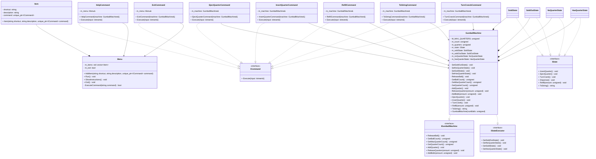

```mermaid
classDiagram
    class Item {
        - shortcut: string
        - description: string
        - command: unique_ptr~ICommand~
        + Item(string shortcut, string description, unique_ptr~ICommand~ command)
    }

    class Menu {
        - m_items: std::vector~Item~ 
        - m_exit: bool
            
        + AddItem(string shortcut, string description, unique_ptr~ICommand~ command)
        + Run() void
        + ShowInstructions() void
        + Exit() void
        - ExecuteCommand(string command) bool
    }

    class ICommand {
        <<interface>>
        + Execute(input: istream&)
    }

    class EjectQuarterCommand {
        + EjectQuarterCommand(machine: GumballMachine&)
        + Execute(input: istream&)

        - m_machine: GumballMachine&
    }

    class InsertQuarterCommand {
        + InsertQuarterCommand(machine: GumballMachine&)
        + Execute(input: istream&)

        - m_machine: GumballMachine&
    }

    class RefillCommand {
        + RefillCommand(machine: GumballMachine&)
        + Execute(input: istream&)

        - m_machine: GumballMachine&
    }

    class ToStringCommand {
        + ToStringCommand(machine: GumballMachine&)
        + Execute(input: istream&)

        - m_machine: GumballMachine&
    }

    class TurnCranckCommand {
        + TurnCranckCommand(machine: GumballMachine&)
        + Execute(input: istream&)

        - m_machine: GumballMachine&
    }

    class HelpCommand {
        + HelpCommand(machine: GumballMachine&)
        + Execute(input: istream&)

        - m_menu: Menu&
    }

    class ExitCommand {
        + ExitCommand(machine: GumballMachine&)
        + Execute(input: istream&)

        - m_menu: Menu&
    }

    class IStateExecutor {
        <<interface>>
        + SetSoldOutState() void
        + SetNoQuarterState() void
        + SetSoldState() void
        + SetHasQuarterState() void
    }

    class IGumballMachine {
        <<interface>>
        + ReleaseBall() void
        + GetBallCount() unsigned
        + GetMaxQuarterCount() unsigned
        + GetQuarterCount() unsigned
        + AddQuarter() void
        + ReleaseQuarters(amount: unsigned) void
        + AddBalls(amount: unsigned) void
    }

    class GumballMachine {
        - SetSoldOutState() void
        - SetNoQuarterState() void
        - SetSoldState() void
        - SetHasQuarterState() void
        
        - ReleaseBall() void
        - GetBallCount() unsigned
        - GetMaxQuarterCount() unsigned
        - GetQuarterCount() unsigned
        - AddQuarter() void
        - ReleaseQuarters(amount: unsigned) void
        - AddBalls(amount: unsigned) void

        + EjectQuarter() void
        + InsertQuarter() void
        + TurnCrank() void
        + Refill(amount: unsigned) void
        + ToString() string
        + GumballMachine(numBalls: unsigned)

        - M_MAX_QUARTERS: unsigned
        - m_count: unsigned
        - m_quarters: unsigned
        - m_state: IState*

        - m_soldState: SoldState
        - m_soldOutState: SoldOutState
        - m_noQuarterState: NoQuarterState
        - m_hasQuarterState: HasQuarterState
    }

    GumballMachine ..|> IGumballMachine
    GumballMachine ..|> IStateExecutor

    SoldState --* GumballMachine
    SoldOutState --* GumballMachine
    NoQuarterState --* GumballMachine
    HasQuarterState --* GumballMachine

    SoldState ..|> IState
    SoldOutState ..|> IState
    NoQuarterState ..|> IState
    HasQuarterState ..|> IState

    class IState {
        <<interface>>
        + InsertQuarter() void
        + EjectQuarter() void
        + TurnCrank() void
        + Dispense() void
        + Refill(amount: unsigned) void
        + ToString() string
    }

    Item --* Menu
    EjectQuarterCommand ..|> ICommand
    EjectQuarterCommand --> GumballMachine
    InsertQuarterCommand ..|> ICommand
    InsertQuarterCommand --> GumballMachine
    RefillCommand ..|> ICommand
    RefillCommand --> GumballMachine
    ToStringCommand ..|> ICommand
    ToStringCommand --> GumballMachine
    TurnCranckCommand ..|> ICommand
    TurnCranckCommand --> GumballMachine

    HelpCommand ..|> ICommand
    HelpCommand --> Menu
    ExitCommand ..|> ICommand
    ExitCommand --> Menu
```