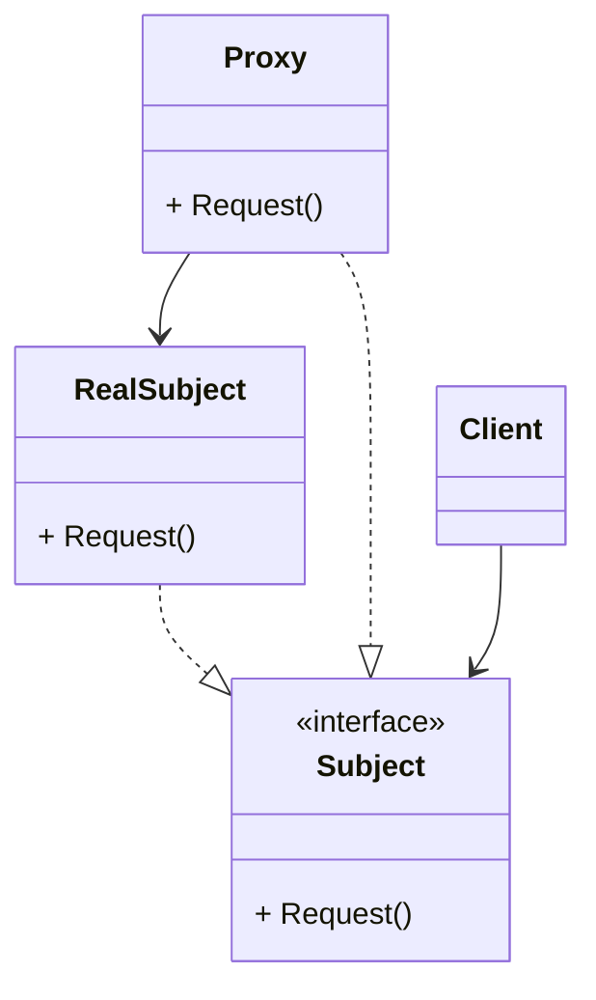
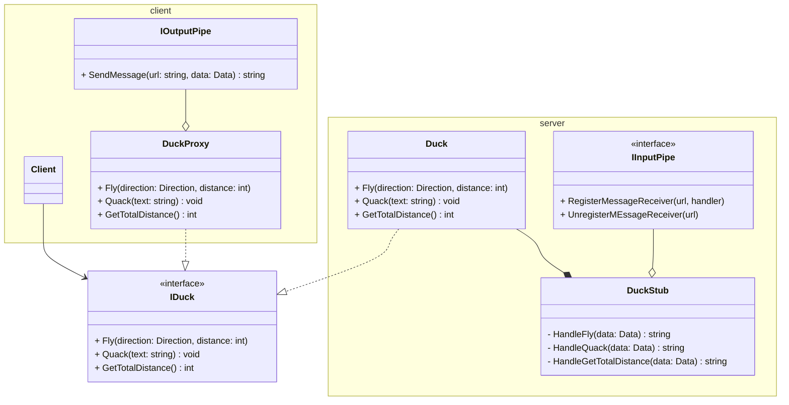
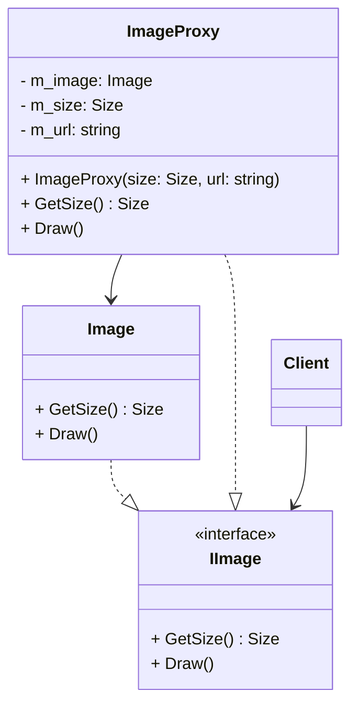
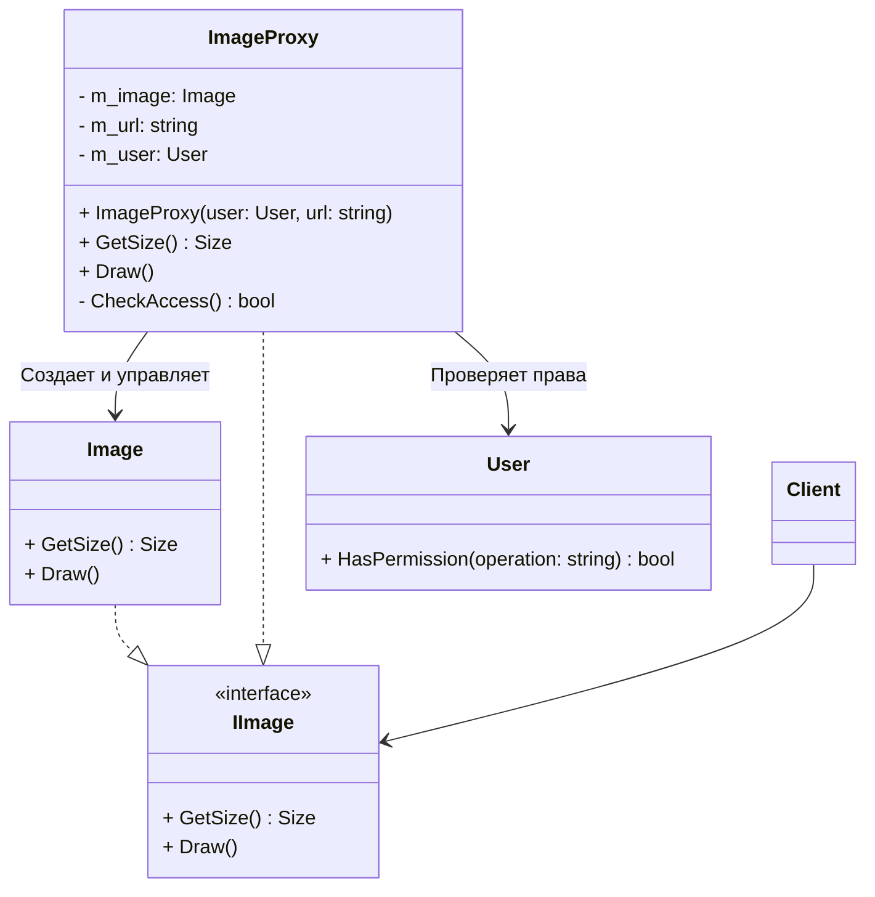

# Паттерн проектирования "Заместитель"
# Table of Contents

- [Паттерн проектирования "Заместитель"](#паттерн-проектирования-заместитель)
- [Table of Contents](#table-of-contents)
  - [Дайте описание паттерна](#дайте-описание-паттерна)
  - [Какие проблемы решает паттерн?](#какие-проблемы-решает-паттерн)
  - [Постройте диаграмму классов этого паттерна.](#постройте-диаграмму-классов-этого-паттерна)
  - [Какие классы/интерфейсы участвуют в паттерне? Какую роль они играют?](#какие-классыинтерфейсы-участвуют-в-паттерне-какую-роль-они-играют)
  - [Какие существуют виды паттерна "Заместитель"? Постройте их диаграммы классов?](#какие-существуют-виды-паттерна-заместитель-постройте-их-диаграммы-классов)
    - [Удаленный заместитель](#удаленный-заместитель)
    - [Виртуальный заместитель](#виртуальный-заместитель)
    - [Защищающий заместитель](#защищающий-заместитель)
  - [Какие у паттерна есть преимущества и недостатки?](#какие-у-паттерна-есть-преимущества-и-недостатки)
  - [Какие существуют альтернативы этому паттерну?](#какие-существуют-альтернативы-этому-паттерну)
  - [Следованию каких принципов SOLID способствует применение паттерна?](#следованию-каких-принципов-solid-способствует-применение-паттерна)

---

## Дайте описание паттерна
Заместитель — это структурный паттерн проектирования, который позволяет подставлять вместо реальных объектов специальные объекты-заменители.
Эти объекты перехватывают вызовы к оригинальному объекту, позволяя сделать что-то до или после передачи вызова оригиналу.

## Какие проблемы решает паттерн?
Паттерн Заместитель предлагает создать новый класс-дублёр, имеющий тот же интерфейс,
что и оригинальный служебный объект. При получении запроса от клиента объект-заместитель сам бы создавал экземпляр служебного объекта и переадресовывал бы ему всю реальную работу.

## Постройте диаграмму классов этого паттерна.

## Какие классы/интерфейсы участвуют в паттерне? Какую роль они играют?

**Subject** - определяет общий интерфейс для сервиса и заместителя. Благодаря этому, объект заместителя можно использовать там, где ожидается объект сервиса.

**RealSubject** - содержит полезную бизнес-логику, заместитель управлет доступом к нему

**Proxy** - хранит ссылку на Subject, чтобы передавать запросы Subject по мере необходимости

**Client** - работает с объектами через интерфейс сервиса. Благодаря этому, его можно «одурачить», подменив объект сервиса объектом заместителя.

## Какие существуют виды паттерна "Заместитель"? Постройте их диаграммы классов?

### Удаленный заместитель
- Предоставляет локального представителя вместо объекта в другом адресном пространстве

### Виртуальный заместитель
- Создаёт «тяжелые» объекты по требованию

### Защищающий заместитель
- Контролирует доступ к исходному объекту

## Какие у паттерна есть преимущества и недостатки?

**Преимущества**
- Позволяет контролировать сервисный объект незаметно для клиента.
- Может работать, даже если сервисный объект ещё не создан.
- Может контролировать жизненный цикл служебного объекта.

**Недостатки**
- Усложняет код программы из-за введения дополнительных классов.
- Увеличивает время отклика от сервиса.

## Какие существуют альтернативы этому паттерну?

- С **Адаптером** вы получаете доступ к существующему объекту через другой интерфейс. Используя Заместитель, интерфейс остается неизменным. Используя Декоратор, вы получаете доступ к объекту через расширенный интерфейс.

- **Фасад** похож на Заместитель тем, что замещает сложную подсистему и может сам её инициализировать. Но в отличие от Фасада, Заместитель имеет тот же интерфейс, что его служебный объект, благодаря чему их можно взаимозаменять.

- **Декоратор** и Заместитель имеют схожие структуры, но разные назначения. Они похожи тем, что оба построены на принципе композиции и делегируют работу другим объектам. Паттерны отличаются тем, что Заместитель сам управляет жизнью сервисного объекта, а обёртывание Декораторов контролируется клиентом.

## Следованию каких принципов SOLID способствует применение паттерна?

- S (Single Responsibility Principle)
- L (Liskov Substitution Principle)
- D (Dependency Inversion Principle)
