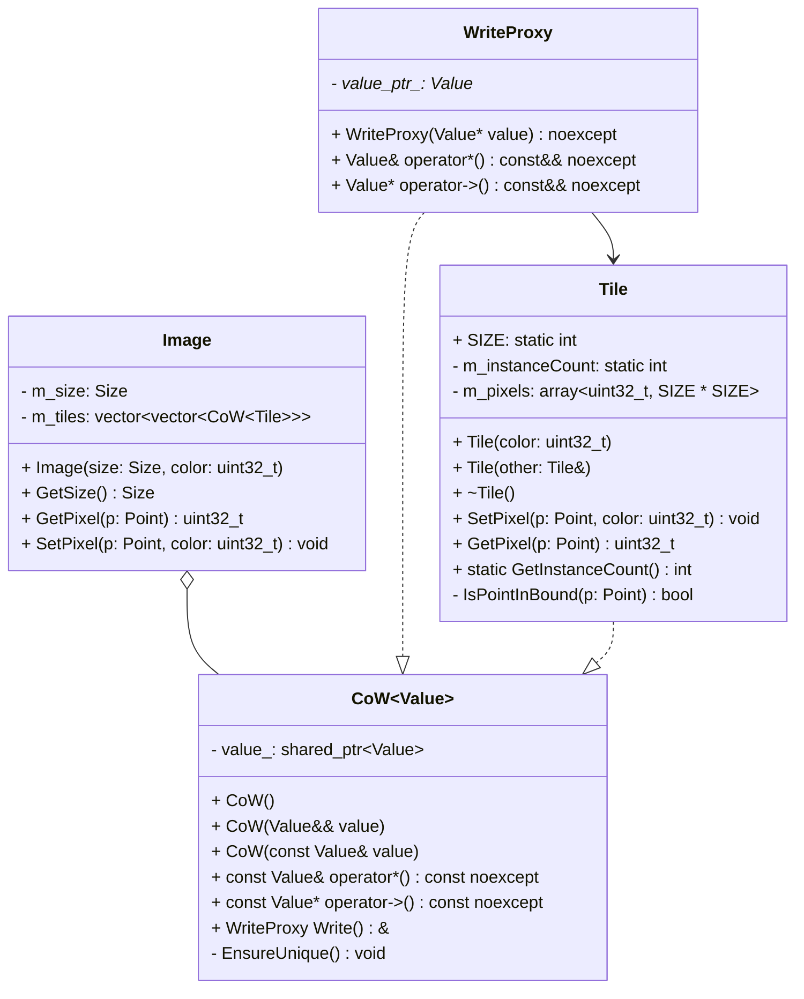

```mermaid
classDiagram
    class Image {
        + Image(size: Size, color: uint32_t)
        + GetSize() Size
        + GetPixel(p: Point) uint32_t
        + SetPixel(p: Point, color: uint32_t) void

        - m_size: Size
        - m_tiles: vector~vector~CoW~Tile~~~
    }

    class CoW~Value~ {
        + CoW()
        + CoW(Value&& value)
        + CoW(const Value& value)
        + const Value& operator*() const noexcept
        + const Value* operator->() const noexcept
        + WriteProxy Write() &
        - EnsureUnique() void
        - value_: shared_ptr~Value~
    }

    class WriteProxy {
        + WriteProxy(Value* value) noexcept
        + Value& operator*() const&& noexcept
        + Value* operator->() const&& noexcept
        - value_ptr_: Value*
    }

    class Tile {
        + Tile(color: uint32_t)
        + Tile(other: Tile&)
        + ~Tile()
        + SetPixel(p: Point, color: uint32_t) void
        + GetPixel(p: Point) uint32_t
        + static GetInstanceCount() int

        + SIZE: static int

        - IsPointInBound(p: Point) bool
        - m_instanceCount: static int 
        - m_pixels: array~uint32_t, SIZE * SIZE~
    }

    Image o-- CoW~Tile~ 
    WriteProxy --> Tile
    WriteProxy ..|> CoW
    Tile ..|> CoW
```